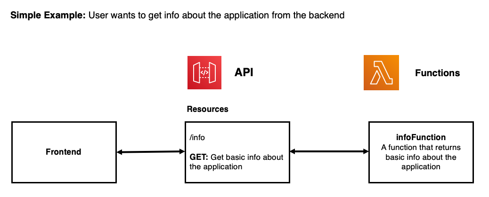
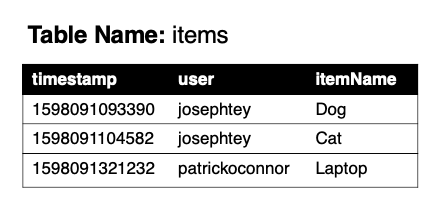

# Build a Fullstack + Serverless Web App using AWS Amplify 

Welcome! This is a beginner workshop targetted at University students (studying IT / Computer Science) who are new to Amazon Web Services. The main question we seek to answer by the end of this workshop is: 

`How can I use AWS to enhance my own personal projects?`

To answer this question, we will focus on using AWS to supercharge **web development**, specifically by:
1. Explaining the **benefits** of using AWS to build web applications.
2. Providing a high-level overview of key AWS services, including Lambda, S3, Cognito, API gateway, etc. 
3. Using AWS Amplify to seamlessly connect a range of AWS services to produce a fullstack, serverless web application. 

We hope that by the end of this workshop, you will not only be confident using AWS in your own projects, but you will realise the vast range of possibilities the AWS Cloud has to offer.

Table of Contents: 
* [Workshop Theory](#workshop-theory)
  * [Traditional Fullstack Web Applications](#Traditional-Fullstack-Web-Applications)
  * [Cloud Native Fullstack Web Applications](#Cloud-Native-Fullstack-Web-Applications)
* [What will we be building?](#What-will-we-be-building)
* [Setting up your Development Environment](#setting-up-your-development-environment)
  * [Provisioning your Cloud 9 IDE](#provisioning-your-cloud-9-ide)
  * [Setting up your Amplify + React application](#Setting-up-your-Amplify-React-application)
* [Adding In-App Authentication](#Adding-In-App-Authentication)
* [Sending data between Frontend and Backend](#Sending-data-between-Frontend-and-Backend)
  * [API Gateway](#api-gateway)
  * [Backend](#backend)
  * [A simple example](#a-simple-example)
* [Connecting to a Database](#Connecting-to-a-Database)
  * [Database Design](#Database-Design)
  * [Implementing the Database](#Implementing-the-Database)
* [Publishing our Web Application](#publish-our-web-application)
* [Adding Machine Learning Features](#Adding-Machine-Learning-Features)

## Definitions
|Term|Description|
|----|-----------|
|AWS| Amazon Web Services|
|S3| Simple Storage Solution, object storage service, also can be used to host static websites|
|Cognito|  Identity management, simplfy the creation and management of users and group, also enables identity|fedation with OpenIDC Connect and Social logins ( Google, FaceBook and Amazon )|
|Cloud 9| An IDE that runs in a browser inside your AWS account.|
|Lambda| AWS's servlerss option, upload code that runs without users needed to provision servers.|
|DynamoDB| Fully managed key value and document database|
|region| A geographic location where AWS has data centers|
|API Gateway| A proxy to aws services that enables an authentigation check point|


## Workshop Theory
As a University student, you may have had some experience creating small, mini applications as part of your assessments - for example, random websites, algorithmic chunks of code, or just random python scripts. But you may be wondering, how are industrial, fully-fledged applications, such as Facebook, Google or even Github, actually built? 

### Traditional Fullstack Web Applications


As seen in the diagram above, the architecture of fully-fledged web applications is fairly complicated, and consist of so many different components responsible for different tasks. 

1. **Frontend**: The user interface of the website. 
2. **Backend**: A server that holds the main code logic of the website, and interacts with the database, file storage systems, and other services. 
3. **Authentication**: A service that authenticates the username and password of the user, allowing the logged-in user to interact with the backend.
4. **Database**: Stores application data.
5. **File Storage**: Stores files and attachments. 
6. **Other Services**: Could include notification services, AI services, and other 3rd party services your web app may be interacting with. 

A few challenges / issues associated with this:
1. With so many different components, it's tedious and time-consuming to manually provision ALL components, configure them, before connecting them all together to build a single application. 
2. Each component needs to run on a server (a computer) - this could be expensive to run over long periods of time AND to maintain. 

The solution: **Amazon Web Services**! 

### Cloud Native Fullstack Web Applications


Building cloud-native fullstack web applications have several benefits:

1. **Services**: As seen in the diagram above, the different components of an application correspond to different AWS services. Rather than building your own components from scratch, AWS provides a range of services to supercharge your web applications. 

   1. **AWS S3**: A file storage service - can be used for hosting your frontend website, as well as other files / attachments. 
   2. **AWS Cognito**: An authentication service - handles user registration, authentication, stores data about all your users + more. 
   3. **AWS API Gateway**: Acts as the 'front door' for the backend to access data, business logic, and other functionality. 
   4. **AWS Lambda**: Lets you run code (in the backend) without provisoning or mangaging servers. 
   5. **AWS DynamoDB**: A database solution that lets you store data without provisoning or mangaging servers. 

2. **Serverless**: All of the services in the above diagram are 'serverless'. This does not mean that they do not run on servers (everything has to be run on a computer), but it means that: 
   1. You don't have to manage or maintain these servers - Amazon takes care of everything. 
   2. You only pay for what you use - it's a LOT cheaper. 

3. **Using AWS Amplify**: While AWS provides all these services to build a web application, a developer must still manually configure and connect all these services together. However, **AWS Amplify** is a framework that allows you to automatically provision and connect ALL these services in literally minutes. **AWS Amplify** acts as a higher-level service that interacts with a range of other AWS services. Each service is treated like a plug-and-play module, rapidly speeding up the process of web application development. 

**We will be using AWS Amplify to build our fullstack, cloud-native web application today!**

## What will we be building? 
We will be building a Shopping List application!

### Demo
**Link**: https://dev.d2jld5htjwnhsz.amplifyapp.com


### Machine Learning Challenge


### Key Features

There are four main components to this application
1. Authentication
   - Ability to log-in, sign up, forget password - all basic 'authentication' operations. 
   - Ability to log-in with external providers, such as Google, Microsoft, Facebook, etc. 
   - You must be authenticated to make requests to the backend
2. A fullstack app architecture with a frontend and backend
   - API that acts as the 'front door' to the backend
   - Ability to send data between frontend and backend, e.g. 'About Info' is from the backend. 
3. Database
   - Fetch all the items associated to a user
   - Ability to create a new item
   - Ability to delete an existing item
4. **BONUS:** Integration with other services
   - Use AI to recognise objects in images
   - Allow users to add these recognised objects

These 4 components are the **basis** of almost **every** application. With these 4 components, the possibilities are endless - you will have the skills to create a forum, a task tracker, a basic social media platform, and so much more. We hope that after this workshop, you will use these core components to build something greater!

### Technologies

We will be using **React** as our frontend framework to build this application. React enhances the process of building user interfaces and websites.
However, because the focus of this workshop is AWS, we will be providing the majority of the React / Frontend code, aside from the code required to connect your frontend to your AWS backend. 

## Setting up your Development Environment

### Provisioning your Cloud 9 IDE

1. Goto your AWS console via this link: https://aws.amazon.com/

2. Search up 'Cloud 9' in the search bar, and click on the first option.

3. Click 'Create Environment'

4. Set the **name** of your environment to be 'AmplifyWorkshop'.\
   Click 'Next Step'.\
   Under 'Instance Type' select 'Other instance type', and search for 't3.medium' in the dropdown search.
   
   **NOTE: t3.medium is required to build and publish our Amplify application.**

5. Leave everything else as default.\
   Click 'Next Step'.\
   Click 'Create Environment'.

### Setting up your Amplify + React application

1. Clone the current repository to your Cloud9 IDE.8
   
   ```bash
   git clone -b frontendOnly https://github.com/josephtey/AWSAmplifyWorkshop.git
   ```
   
2. Move into the cloned directory, and install all required packages. 

   ```bash
   cd AWSAmplifyWorkshop
   npm install
   ```
   
3. Install the Amplify CLI and initialise the project (as an Amplify app)
   ```bash
   npm install -g @aws-amplify/cli
   ```

4. Initialise the project as an Amplify application

   ```bash
   amplify init
   
   ? Enter a name for the project: AWSAmplifyWorkshop
   ? Enter a name for the environment: dev
   ? Choose your default editor: None
   ? Choose the type of app that youre building: javascript
   
   Please tell us about your project
   ? What javascript framework are you using: react
   ? Source Directory Path: src
   ? Distribution Directory Path: build
   ? Build Command:  npm run-script build
   ? Start Command: npm run-script start
   
   AWS access credentials can not be found.
   ? Setup new user (Y/n) Yes
   
   Press Enter (you dont need to click the link for this one)
   
   Specify the AWS Region
   ? region:  ap-southeast-2
   Specify the username of the new IAM user:
   ? user name:  amplify-workshop
   Complete the user creation using the AWS console
   
   Click on the link that is provided
   ```
   
   You will get a link to configure your Identity Access Management user.\
   Click on it, keep clicking 'Next' and leave everything default until you reach 'Create User'.\
   Click 'Download .csv' to save your User Credentials.
   
   Go back to your Cloud9.\
   Your `accessKeyId` and `secretAccessKey` will be in the CSV file that you just downloaded.
   
   ```bash
   ? accessKeyId: ********************
   ? secretAccessKey:  ****************************************
   ? region:  ap-southeast-2
   ? Profile Name:  default
   
   Successfully set up the new user.
   For more information on AWS Profiles, see: https://docs.aws.amazon.com/cli/latest/userguide/cli-multiple-profiles.html
   
   ? Do you want to use an AWS profile? Yes
   ? Please choose the profile you want to use: default
   ```
   After this step, some deployment resources are created in AWS including an S3 bucket (for deployment) and IAM roles.

5. Connect your React web app to Amplify.

   Using the sidebar in the Cloud9 interface, expand the AWSAmplifyWorkshop folder and open the file `src/index.js`. Add the following code **after the import statements**:
   
   ```javascript
   import config from './aws-exports'
   import Amplify from 'aws-amplify'
   Amplify.configure(config)
   ```
   Save the file.

6. Run the React application locally
   ```bash
   npm start
   ```
   
7. Preview your Web Application
   
   After the app has compiled successfully, click 'Tools' in the toolbar up top, click 'Preview' and finally click 'Preview Running Application'. 
   Open the preview in another tab by clicking the arrow / box button on the right of the search bar. 

**You should see a basic Shopping List app in your browser! However, there is currently no functionality. Let's use AWS to fix this!**

## Adding In-App Authentication
AWS Amplify allows us to quickly leverage AWS Cognito as its identity service. AWS Cognito is a robust user directory service that handles user registration, authentication, account recovery & other operations. 

There are two steps to adding authentication:
1. Provisioning the Authentication service (AWS Cognito)
2. Connecting the Authentication service to your Web App

With Amplify, this is super simple, so let's start:

0. Add a new terminal in your Cloud 9 IDE by clicking `Window` and then 'New Terminal'
   
   Change directory into your Amplify project. 
   ```bash
   cd AWSAmplifyWorkshop
   ```

1. Provision the Cognito authentication service:
    
   Run the following command, and follow the guided instructions:
   ```bash
   amplify auth add

   Do you want to use the default authentication and security configuration? Default configuration
   How do you want users to be able to sign in? Username
   Do you want to configure advanced settings?  No, I am done.
   ```    
    
   To push it to the Cloud, run the following command:

   ```bash
   amplify push
   ```
   
   You should see a 'status' section with 'auth' as a new component that you just created. Type 'Y' and hit enter to confirm this process.
   
   Amplify is now provisioning the authentication service - this will take some time. 
  
3. Add a login and signup page to our Web Application (while we are waiting for the service to be provisioned).
   
   Open the file `src/index.js`, and import the Authenticator module by adding the following code **after the rest of your imports**. This module includes the UI components for our login and sign up page:
   
   ```javascript
   import { AmplifyAuthenticator } from '@aws-amplify/ui-react';
   ```
   
   In the same file, surround the `<App />` tag with the `<AmplifyAuthenticator>` tag. 
   Essentially, replace `<App />` with the following code:
   
   ```javascript
    <AmplifyAuthenticator>
      <App />
    </AmplifyAuthenticator>
    ```
    
   Any content you surround `<AmplifyAuthenticator>` with will require authentication / users to log-in. As such, when users try to access the application, they will be redirected to a login page if they are unauthenticated. 
   
4. Add a log out button.
   
   Open the file `src/components/NavBar.js`, as the log-out button is located in the Navigation Bar. 
   
   We need to import an authentication module that will allow us to perform tasks related to authentication, including sign-out. Add this to the top of your code:
   
   ```javascript
   import { Auth } from 'aws-amplify';
   ```
   
   Look for the Log out button, and replace the 'onClick' function with the following code:
   ```javascript
   onClick={async ()=>{
       await Auth.signOut();
   }}
   ```
    
4. Preview updated application.
   
   If Amplify is finished pushing the authentication service to the cloud, open the tab where your application is being previewed. You should now see a login screen! Follow the on-screen instructions to make an account, verify your email, and then login. 
   
   Let's see what you just did in the Amazon Console.
  
   1. Open the AWS console: https://console.aws.amazon.com/console/home
   2. Search up 'Cognito' in the main catalog search bar, and click the first option.
   3. Click 'Manage user pools'.
   4. Click your Amplify project.
   5. Click 'Users and Groups' under 'General Settings'. 
   
   You should see the account you just made.
   
**Congrats! You have just set up an Authentication service, and connected it to your web application.** 

## Sending data between Frontend and Backend
Now that we've set up authentication, let's learn about how we send data between our frontend and backend systems. 
When building applications on the cloud, this is a simple visual depiction of a frontend to backend communication stream:


There are four main components involved this communication flowchart. To explain how they interact with each other, I will use the analogy of how humans respond to the world around us. 

It's a very hot day, and you feel hot. But why? Firstly, there's a **stimuli**: heat. Secondly, there are **sensors** on our skin that detect this high temperature. After sensing this, **neurons** throughout our body sends this information to our **brain**. Our **brain** registers that we are HOT, and then triggers a range of actions - fanning ourselves, taking off our clothes, etc. 

Full-stack apps behave similarly. The user action is the stimuli - it triggers this whole process. The frontend, whether in the form of a button, a text field, etc., is the sensor - it registers the user action. The API Gateway acts as the neurons - it sends information to different places depending on the user action. And lastly, the backend is the brain - it receives these 'requests', thinks about how to respond, and then carries out certain actions.

Let's go into more detail about these services: 

### API Gateway
The API gateway acts as the 'front-door' to your backend systems, and directs your requests to relevant functions and services.


API Gateways consist of **paths**, where each path corresponds to a specific **action** (e.g. updating item, getting item, etc.)
As seen in the diagram above, paths consist of two components: 

1. **Resources**: A collection of items, such as books or users.
2. **Methods**: Different ways in which you can interact with that specific resource, including: 
   1. GET: Get a list of items
   2. POST: Creating a new item
   3. PUT: Updating an existing item
   4. DELETE: Deleting an existing item
   

A frontend system can send a request to a specific 'path' in order to trigger an action. 
For example, in the diagram above, if I wanted to get a list of books, I would send a GET request to the '/books' resource. 

This **resource** and **method** API design is part of the REST API specification - keep in mind, this is just a naming / standard convention for designing your APIs. 

### Backend
The backend is the 'brain' of your application, and is where most of code responsible for processing, logic, and interacting with other services resides. 


One way to architect your backend is to use Lambda functions. You can create MULTIPLE Lambda functions that run different code blocks to carry out different tasks. For example, I could have a Lambda responsible for database interactions, and another Lambda for interacting with machine learning services. The cool thing about Lambda functions is that they are 'serverless' - you don't need to care about servers, it's significantly cheaper, and scales automatically. 

These Lambda functions can also interact with other services, including databases, file storage systems, and AI services. 


### A simple example
Now that we understand what an API is, how our backend is configured, and how to send data from the frontend to backend, let's create a simple workflow. 



**Scenario:** As a user, I want to get basic info about the application from the backend. 

Based on the above diagram, there are 3 things we have to do:
1. Create the API Gateway with the path `/info`.
2. Create the Lambda function called `infoFunction` that returns this information, and connect this to the API. 
3. Send a request to the API Gateway from our web application, and receive the info from the backend. 

**Let's try this in our application**

Run the following command:
```bash
amplify api add
```
**You will now be asked a series of questions by Amplify:**

1. Create the API Gateway with the path `/info`

   ```bash
   ? Please select from one of the below mentioned services: REST
   ? Provide a friendly name for your resource to be used as a label for this category in the project: mainAPI
   ? Provide a path (e.g., /book/{isbn}): /info
   ```

2. Create the Lambda function called `infoFunction`, and connect this to the API. 

   ```bash
   ? Choose a Lambda source: Create a new Lambda function
   ? Provide a friendly name for your resource to be used as a label for this category in the project: infoFunction
   ? Provide the AWS Lambda function name: infoFunction
   ? Choose the runtime that you want to use: NodeJS
   ? Choose the function template that you want to use: Serverless ExpressJS function (Integration with API Gateway)
   ? Do you want to access other resources in this project from your Lambda function? No
   ? Do you want to invoke this function on a recurring schedule? No
   ? Do you want to configure Lambda layers for this function? No
   ? Do you want to edit the local lambda function now? No
   Successfully added resource infoFunction locally.

   ? Restrict API access Yes
   ? Who should have access? Authenticated users only
   ? What kind of access do you want for Authenticated users? read
   ? Do you want to add another path? No
   ```
   
   You have just created a Lambda function called `infoFunction` that runs on a `NodeJS` environment (javascript language).
   
3. Edit the `infoFunction` Lambda function so it returns info about the application
   
   Open the file `amplify/backend/function/infoFunction/src/app.js`, and inspect the file. You will notice that Amplify has already created `GET`, `POST`, `PUT` and `DELETE` methods for the `info` resource. However, we are only concerned with the `GET` method of this resource. Look for this code block:
   
   ```javascript
   app.get('/info', function(req, res) {
     // Add your code here
     res.json({success: 'get call succeed!', url: req.url});
   });
   ```

   Replace that code with the following code. 
   
   ```javascript
   app.get('/info', function(req, res) {
     res.json({
      "message": "I created this application during the CCA x CISSA x AWS workshop event!"
     });
   });
   ```
   
   Save the file.
   
   You just edited the data that is being sent back from the backend. Now, if you send a GET request to '/info', you will receive the following payload in your      frontend:
   
   ```json
   {
     "message": "I created this application during the CCA x CISSA x AWS workshop event!"
   }
   ```
   
4. Push the function to the cloud by running the following command:
   ```bash
   amplify push
   ```
   
   While you are waiting, think about what you just did. You set up an API, a Lambda function, edited the Lambda function, and just pushed it to the cloud. 
   
   After the process is finished, let's see how this looks in the Amazon Console.
  
   1. Open the AWS console: https://console.aws.amazon.com/console/home
   2. Search up 'Lambda' in the main catalog search bar, and click the first option.
   3. Click on `infoFunction-dev`, and view the code of the function by scrolling down to `Function Code`. This is the Lambda function that you just pushed up to       the cloud. 
   4. Click on `Services` at the top, and search for `API Gateway`, and click on `mainAPI`. This is the API Gateway you just pushed to the Cloud. Notice the 'info' resource that you have just created. 
   

5. Connect our Web Application to the API Gateway to get the about info. 

   Open the file `src/api/db.js` - this file is responsible for retrieving and sending data to our API. 
   
   To connect to the API, we need to import a module provided by Amplify. This module allows us to easily communicate with the API. Add this to the top of your file:
   
   ```bash
   import { API } from 'aws-amplify';
   ```
   
   ### getAboutInfo() Function
   The function `getAboutInfo` is used to get the application info. To configure this function to send a request to our API Gateway, replace it with the following code:
   
   ```javascript
   export async function getAboutInfo() {
       const data = await API.get('mainAPI', '/info', {})
       return data.message
   }
   ```
   
   **Code Breakdown**
   - Uses API (the Amplify module that you imported) to send a `GET` request to `/info` in the `mainAPI` API that you configured. 
   - In doing this, the API gateway will call the `infoFunction` Lambda function that you previously created.
   - `infoFunction` will return a message back to the API, which will in turn send it back to our web application. 
   
4. Preview updated application.

   Congrats! Your web app now sends a request to the API gateway, and should receive the info that is returned by the Lambda. Open the browser tab where your app is being previewed, and you should see the info populated at the top of your application!
   
Now that you understand the basics of how APIs, Lambdas and connecting everything works, let's connect a database to our application. 

## Connecting to a Database
AWS Amplify uses AWS DynamoDB as its database service - a serverless, NoSQL database solution that supports key-value and document data structures. 

### Database Design


The above diagram is the design for the database. Columns include:

1. `user`: Each user should have their own items. This column would allow us to display only the items relevant to a specific user. 
2. `timestamp`: Tracks the exact time in which items are created. Allows us to sort the table by creation time. 
3. `itemName`: The name of the item being created. 

DynamoDB tables require a primary key to uniquely identify each item in the table. A primary key can be a single column, OR, a combination that includes a partition key and a sort key. For our table:

1. **Partition Key** is `user`. This allows us to **partition** our queries based on the `user` column, so we can display items relevant to only the logged-in user. 
2. **Sort Key** is `timestamp`. This allows us to **sort** our table based on creation time. 

### Implementing the Database


Based on the diagram, we have to provision the database, create a new Lambda function for database interactions, update the API with new paths, before connecting it with our web application. 

1. Create the Dynamo DB Table
   
   Run the following command, and follow the guided instructions
   ```javascript
     amplify storage add
    
     ? Please select from one of the below mentioned services: NoSQL Database

     Welcome to the NoSQL DynamoDB database wizard
     This wizard asks you a series of questions to help determine how to set up your NoSQL database table.

     ? Please provide a friendly name for your resource that will be used to label this category in the project: items
     ? Please provide table name: items

     You can now add columns to the table.

     ? What would you like to name this column: user
     ? Please choose the data type: string
     ? Would you like to add another column? Yes
     ? What would you like to name this column: timestamp
     ? Please choose the data type: number
     ? Would you like to add another column? Yes
     ? What would you like to name this column: itemName
     ? Please choose the data type: string
     ? Would you like to add another column? No

     ? Please choose partition key for the table: user
     ? Do you want to add a sort key to your table? Yes
     ? Please choose sort key for the table: timestamp

     ? Do you want to add global secondary indexes to your table? No
     ? Do you want to add a Lambda Trigger for your Table? No
    ```
    
    Push the DynamoDB Table to the cloud by running the following command:
   ```bash
   amplify push
   ```
   
   In the AWS console, search for DynamoDB or [click this](https://ap-southeast-2.console.aws.amazon.com/dynamodb/home?region=ap-southeast-2).\
   Click on "tables" on the left then `items-dev` - this is the table you just pushed to the Cloud.\
   You can click on the "Items" tab to see the data. Currently, it should be empty.  

2. Create the Lambda function called `databaseFunction` to interact with the DynamoDB Table, and hook it up to the API. 

    We will be using a **function template** provided by Amplify specifically for database interactions.
    
    It is called `CRUD function for DynamoDB (Integration with API Gateway)`, where `CRUD` stands for **Create, Read, Update and Delete***, signifying it has pre-built functions for creating, reading, updating and deleting items within the database. 
    
   
    
    
    Firstly, let's add a new path to our API gateway. As all of the paths for `databaseFunction` begin with `/items`, we only need to add one more path to our `mainAPI` API.
    
    ```bash
    amplify api update
    
    ? Please select from one of the below mentioned services: REST
    ? Please select the REST API you would want to update mainAPI
    ? What would you like to do: Add another path
    ? Provide a path (e.g., /book/{isbn}): /items
    ```
    
    Secondly, let's setup the `databaseFunction` Lambda function that uses the CRUD template.
    
    ```bash
    ? Choose a Lambda source: Create a new Lambda function
    ? Provide a friendly name for your resource to be used as a label for this category in the project: databaseFunction
    ? Provide the AWS Lambda function name: databaseFunction
    ? Choose the runtime that you want to use: NodeJS
    ? Choose the function template that you want to use: CRUD function for DynamoDB (Integration with API Gateway)
    ? Choose a DynamoDB data source option: Use DynamoDB table configured in the current Amplify project
    ? Choose from one of the already configured DynamoDB tables: items
    ? Do you want to access other resources in this project from your Lambda function? No
    ? Do you want to invoke this function on a recurring schedule? No
    ? Do you want to configure Lambda layers for this function? No
    ? Do you want to edit the local lambda function now? No
    
    ? Restrict API access Yes
    ? Who should have access? Authenticated users only
    ? What kind of access do you want for Authenticated users? create, read, update, delete
    ? Do you want to add another path? No
    ```
    
    Open the file `amplify/backend/function/databaseFunction/src/app.js`, and inspect the file. Scrolling through it, you should notice the CRUD paths that have been automatically generated (same as the diagram). 
    
    Push the Lambda function and the API Gateway with the updated path to the cloud by running the following command:
    ```bash
    amplify push
    ```
    
    You have just set up the backend integration for your database. Open the AWS Console and search for Lambda and API Gateway to see the newly created function, and recently added path. 
    
3. Connect your Web Application to the database via the API gateway. 

   Currently, when we click 'Add' in our application, nothing happens. Let's change this.
   
   Open the file `src/api/db.js` - the file responsible for all the calls to the API from the frontend. 
   
   Since we need to connect to the API, we need the API module from the Amplify library - this is already imported. We also need to get the **username** of the currently authenticated user, so we also need to import the Auth module. To do this, add the import after the API module:
   
   Replace:
   ```javascript
   import { API } from 'aws-amplify';
   ```
   with
   ```javascript
   import { API, Auth } from 'aws-amplify';
   ```
   
   **This file has three empty functions: `getUserItems`, `getItem`, and `deleteItem`.** 
   
   ### getUserItems() Function
   This function is to fetch all the items of a specific user. The code for this function is below:
   ```javascript
   export async function getUserItems() {
       const userData = await Auth.currentAuthenticatedUser()
       const data = await API.get('mainAPI', '/items/' + userData.username, {})

       return data
   }
   ```
   
   **Code Breakdown**
   - Line 1: Gets the details of the currently authenticated user. We use this to get the logged-in user's username. 
   - Line 2: Sends a `GET` request to the `mainAPI` API you configured, with the resource `/items`, and returning only the data of the current user. 
   
   ### addItem() Function
   This function is to add an item that a user created. The code for this function is below:
   ```javascript
   export async function addItem(itemName) {
       const userData = await Auth.currentAuthenticatedUser()

       const response = await API.post('mainAPI', '/items', {
           body: {
               timestamp: new Date().getTime(),
               user: userData.username,
               itemName
           }
       })

       return response
   }
   ```
   
   **Code Breakdown**
   - Sends a `POST` request to the `mainAPI` API you configured, with the resource `/items`. A `body` payload is also sent to the API, where we specify the data of  the new item we are creating. 
   
   
   ### deleteItem() Function
   This function is to delete an item from a user's account. The code for this function is below:
   ```javascript
   export async function deleteItem(timestamp) {
       const userData = await Auth.currentAuthenticatedUser()
       const response = await API.del('mainAPI', '/items/object/' + userData.username + '/' + timestamp, {})

       return response
   }
   ```
   
   **Code Breakdown**
   - Sends a `DELETE` request to the `mainAPI` API you configured, with the resource `/items`. We specify the username and timestamp, as the combination of both will uniquely identify an item. 
   
6. Push the changes
```bash
amplify push
```
5. Congrats! You have successfully setup a Dynamo DB Table, and hooked it up to your web application. 
   Open the browser tab where your app is being previewed, and you should be able to get, create and delete items!


## Publishing our Web Application
We've finished our application! However, one problem - our application is still running locally on our Cloud9 instance. 
The last step is to host our frontend website on the cloud, so it can be accessed ANYWHERE and ANYTIME, as long as you have an internet connection. 

To do this, run the following command, and follow the guided instructions

```bash
amplify hosting add

? Select the plugin module to execute: Hosting with Amplify Console
? Choose a type: Manual Deployment
```

Lastly, run the final command to publish your application

```bash
amplify publish
```

Congrats, you have just published your application! The console should output a **link** that you can click on to access your published website. You can access this website ANYWHERE - on your phone, laptop, iPad. You can send the link to your friends and get them to make an account!


## Adding Machine Learning Features

Challenge time! We've just created a fullstack web application using AWS Amplify, implementing authentication, a database, an API, and a Lambda backend. However, AWS Amplify is a LOT more powerful, and has many more plug-and-play modules that you can incorporate in your application. For example:


For our challenge, let's try and incorporate the **predictions** module in our shopping list application. Specifically, we will build a feature that allows users to upload photos, before using AI object recognition to label ALL of the entities within the image, and allowing the user to add those 'labels' within their shopping list. Here is a demo of the finished product: 


A few pointers: 
- Your web application should DIRECTLY connect to Amplify's Prediction service in the file: `src/api/predictions.js`
- Read the documentation as to how you should implement this: https://docs.amplify.aws/lib/predictions/label-image/q/platform/js
- Good luck! 


