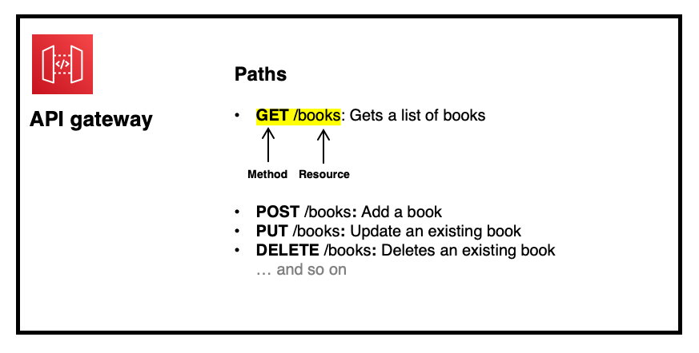

# Build a Fullstack + Serverless Web App using AWS Amplify 

Welcome! This is a beginner workshop targetted at University students (studying IT / Computer Science) who are new to Amazon Web Services. The main question we seek to answer by the end of this workshop is: 

`How can I use AWS to enhance my own personal projects?`

To answer this question, we will focus on using AWS to supercharge **web development**, specifically by:
1. Explaining the **benefits** of using AWS to build web applications.
2. Providing a high-level overview of key AWS services, including Lambda, S3, Cognito, API gateway, etc. 
3. Using AWS Amplify to seamlessly connect a range of AWS services to produce a fullstack, serverless web application. 

We hope that by the end of this workshop, you will not only be confident using AWS in your own projects, but you will realise the vast range of possibilities the AWS Cloud has to offer.

Table of Contents: 
* [Introduction to Workshop](#workshop-theory)
  * [Traditional Fullstack Web Applications](#Traditional-Fullstack-Web-Applications)
  * [Cloud Native Fullstack Web Applications](#Cloud-Native-Fullstack-Web-Applications)
* [Setting up your Development Environment](#setting-up-your-development-environment)
* [Adding In-App Authentication](#Adding-In-App-Authentication)
  * [Provisioning the Authentication service (AWS Cognito)](#Provisioning-the-Authentication-service-(AWS-Cognito))
  * [Connecting the Authentication service to your Web App](#Connecting-the-Authentication-service-to-your-Web-App)
* [Sending data between Frontend and Backend]
* [Connecting to a Database]
* [Adding Machine Learning Features]

## Workshop Theory
As a University student, you may have had some experience creating small, mini applications as part of your assessments - for example, random websites, algorithmic chunks of code, or just random python scripts. But you may be wondering, how are industrial, fully-fledged applications, such as Facebook, Google or even Github, actually built? 

### Traditional Fullstack Web Applications


As seen in the diagram above, the architecture of fully-fledged web applications is fairly complicated, and consist of so many different components responsible for different tasks. 

1. **Frontend**: The user interface of the website. 
2. **Backend**: A server that holds the main code logic of the website, and interacts with the database, file storage systems, and other services. 
3. **Authentication**: A service that authenticates the username and password of the user, allowing the logged-in user to interact with the backend.
4. **Database**: Stores application data.
5. **File Storage**: Stores files and attachments. 
6. **Other Services**: Could include notification services, AI services, and other 3rd party services your web app may be interacting with. 

A few challenges / issues associated with this:
1. With so many different components, it's tedious and time-consuming to manually provision ALL components, configure them, before connecting them all together to build a single application. 
2. Each component needs to run on a server (a computer) - this could be expensive to run over long periods of time AND to maintain. 

The solution: **Amazon Web Services**! 

### Cloud Native Fullstack Web Applications


Building cloud-native fullstack web applications have several benefits:

1. **Services**: As seen in the diagram above, the different components of an application correspond to different AWS services. Rather than building your own components from scratch, AWS provides a range of services to supercharge your web applications. 

   1. **AWS S3**: A file storage service - can be used for hosting your frontend website, as well as other files / attachments. 
   2. **AWS Cognito**: An authentication service - handles user registration, authentication, stores data about all your users + more. 
   3. **AWS API Gateway**: Acts as the 'front door' for websites to access data, business logic, and other functionality from your backend. 
   4. **AWS Lambda**: Lets you run code (in the backend) without provisoning or mangaging servers. 
   5. **AWS DynamoDB**: A database solution that lets you store data without provisoning or mangaging servers. 

2. **Serverless**: All of the services in the above diagram are 'serverless'. This does not mean that they do not run on servers (everything has to be run on a computer), but it means that: 
   1. You don't have to manage or maintain these servers - Amazon takes care of everything. 
   2. You only pay for what you use - it's a LOT cheaper. 

3. **Using AWS Amplify**: While AWS provides all these services to build a web application, a developer must still manually configure and connect all these services together. However, **AWS Amplify** is a framework that allows you to automatically provision and connect ALL these services in literally minutes. **AWS Amplify** acts as a higher-level service that interacts with a range of other AWS services. Each service is treated like a plug-and-play module, rapidly speeding up the process of web application development. 

**We will be using AWS Amplify to build our fullstack, cloud-native web application today!**

## Setting up your Development Environment

### Provisioning a Cloud 9

1. Goto your AWS console via this link: https://aws.amazon.com/

2. Search up and click Cloud 9 in the 'Services' section.

3. Click 'Get Started'

4. Choose a name (e.g. amplify-workshop). Click 'Next'. Under 'Instance Type' select 'Other instance type', and search for 't3.medium' in the dropdown search.

5. Leave everything else as default, and click 'Create Environment'.

### Setting up your Amplify + React application

1. Clone the current repository to your Cloud9 IDE.8
   
   ```bash
   git clone
   ```
   
2. Move into the cloned directory, and install all required packages. 

   ```bash
   cd amplify-workshop
   npm install
   ```
   
3. Install the Amplify CLI and initialise the project (as an Amplify app)
   ```bash
   npm install -g @aws-amplify/cli
   amplify init
   ```
   
4. To connect your React web app to Amplify, open the file `src/index.js`, and add the following code:

   In `src/index.js`, **after the import statements**:
   
   ```javascript
   import Amplify from 'aws-amplify'
   Amplify.configure(config)
   ```

5. Run the React application
   ```bash
   npm start
   ```
   
6. After the app has compiled successfully, click 'Tools' in the toolbar up top, click 'Preview' and finally click 'Preview Running Application'. 
   Open the preview in another tab by clicking the arrow / box button on the right of the search bar. 

**You should see a basic React web application running in your browser!**


## Adding In-App Authentication
AWS Amplify uses AWS Cognito as its authentication service. AWS Cognito is a robust user directory service that handles user registration, authentication, account recovery & other operations. 

There are two steps to adding authentication:
1. Provisioning the Authentication service (AWS Cognito)
2. Connecting the Authentication service to your Web App

### Provisioning the Authentication service (AWS Cognito)

1. To add authentication to your Amplify project, run the following command, and follow the guided instructions.

    ```bash
    amplify auth add
    
    Do you want to use the default authentication and security configuration? Default configuration
    How do you want users to be able to sign in? Username
    Do you want to configure advanced settings?  No, I am done.
    ```    
    
2. To push it to the Cloud, run the following command:

   ```bash
   amplify push
   ```
   
   You should see a 'status' section with 'auth' as a new component that you just created. Type 'Y' and hit enter to confirm this process.
   
3. Congrats! Your authentication service has been created. Let's take a look at this in the Amazon Console.
  
   1. Open the AWS console: https://console.aws.amazon.com/console/home
   2. Search up 'Cognito' in the main catalog search bar, and click the first option.
   3. Click 'Manage user pools'.
   4. Click your Amplify project.
   
   This is where you can edit the settings of your application's authentication service. Feel free to explore the different settings you can adjust. 
   
   Click on 'Users and Groups' under 'General Settings' on the left sidebar - this is where you can track and manage your application's users.\
   Currently, you have no users. 
   
### Connecting the Authentication service to your Web App

4. Although our authentication service has been provisioned, we still need to add a login / signup page in our application.

   To do this, open the file `src/index.js`, and import the Authenticator module by adding the following code:
   
   ```javascript
   import { AmplifyAuthenticator } from '@aws-amplify/ui-react';
   ```
   
   In the same file, surround the `<App />` tag with the `<AmplifyAuthenticator>` tag. It should look like this:
   
   ```javascript
    <AmplifyAuthenticator>
      <App />
    </AmplifyAuthenticator>
    ```
    
   Any content you surround `<AmplifyAuthenticator>` with will require authentication / users to log-in.\
   As such, when users try to access the application, they will be redirected to a login page if they are unauthenticated. 
    
5. Open the tab where your application is being previewed. You should now see a login screen!
   
   Follow the instructions to make an account, verify your email, and then login. 
   
   Access the Cognito dashboard in the AWS Console (https://console.aws.amazon.com/console/home), click 'Users and Groups', and you should see the user account that you just created!
   
**Congrats! You have just set up an Authentication service, and connected it to your web application.** 

## Sending data between Frontend and Backend
Now that we've set up authentication, let's learn about how we send data between our frontend and backend systems. 

### Overview
When building applications on the cloud, this is a simple visual depiction of a frontend to backend communication stream:


There are four main components involved this communication flowchart. To explain how they interact with each other, I will use the analogy of how humans respond to the world around us. 

It's a very hot day, and you feel hot. But why? Firstly, there's a *stimuli*: heat. Secondly, there are **sensors** on our skin that detect this high temperature. After sensing this, **neurons** throughout our body sends this information to our **brain**. Our **brain** registers that we are HOT, and then triggers a range of actions - fanning ourselves, taking off our clothes, etc. 

Full-stack apps behave similarly. The user action is the stimuli - it triggers this whole process. The frontend, whether in the form of a button, a text field, etc., is the sensor - it registers the user action. The API Gateway acts as the neurons - it sends information to different places depending on the user action. And lastly, the backend is the brain - it receives these 'requests', thinks about how to respond, and then carries out certain actions.

Let's go into more detail about these services: 

### API Gateway
The API gateway acts as the 'front-door' to your backend systems, and directs your requests to relevant functions and services.



API Gateways consist of **paths**, where each path corresponds to a specific **action** (e.g. updating item, getting item, etc.)
As seen in the diagram above, paths consist of two components: 

1. **Resources**: A collection of items, such as books or users.
2. **Methods**: Different ways in which you can interact with that specific resource, including: 
   1. GET: Get a list of items
   2. POST: Creating a new item
   3. PUT: Updating an existing item
   4. DELETE: Deleting an existing item
   

A frontend system can send a request to a specific 'path' in order to trigger an action. 
For example, in the diagram above, if I wanted to get a list of books, I would send a GET request to the '/books' resource. 

This **resource** and **method** API design is part of the REST API specification - keep in mind, this is just a naming / standard convention for designing your APIs. 

### Backend
The backend is the 'brain' of your application, and is where most of code responsible for processing, logic, and interacting with other services resides. 


One way to architect your backend is to use Lambda functions. You can create MULTIPLE Lambda functions that run different code blocks to carry out different tasks. For example, I could have a Lambda responsible for database interactions, and another Lambda for interacting with machine learning services. The cool thing about Lambda functions is that they are 'serverless' - you don't need to care about servers, it's significantly cheaper, and scales automatically. 

These Lambda functions can also interact with other services, including databases, file storage systems, and AI services. 


### A simple example
Now that we understand what an API is, how our backend is configured, and how to send data from the frontend to backend, let's create a simple workflow. 


**Scenario:** As a user, I want to get basic info about the application from the backend. 
Based on the above diagram, there are 3 things we have to do:

1. Create the Lambda function called `infoFunction` that returns this information. 
   
   To do this, run the following command, and follow the guided instructions:
   ```bash
   amplify function add
   
   ? Select which capability you want to add: Lambda function (serverless function)
   ? Provide a friendly name for your resource to be used as a label for 
   this category in the project: infoFunction
   ? Provide the AWS Lambda function name: infoFunction
   ? Choose the runtime that you want to use: NodeJS
   ? Choose the function template that you want to use: Serverless ExpressJS function (Integration with API Gateway)
   ? Do you want to access other resources in this project from your Lambda function? No
   ? Do you want to invoke this function on a recurring schedule? No
   ? Do you want to configure Lambda layers for this function? No
   ? Do you want to edit the local lambda function now? Yes
   ```
   
   Open the file `amplify/backend/function/infoFunction/src/app.js`, and inspect the file.\
   You will notice that Amplify has already created GET, POST, PUT and DELETE methods for the 'info' resource.\
   Find the line `app.get('/info', function(req, res) {`, and replace the corresponding code block with the following:\
   
   ```javascript
   app.get('/info', function(req, res) {
     
     res.json({
      "message": "I created this application during the CCA x CISSA x AWS workshop event!"
     });
     
   });
   ```
   
   Now, if you send a GET request to '/info', you will receive the following payload in your frontend:
   ```json
   {
    "message": "I created this application during the CCA x CISSA x AWS workshop event!"
   }
   ```
   
   Push the function to the cloud by running the following command:
   ```bash
   amplify push
   ```
   
   In the AWS console, search for Lambda, and click on `infoFunction-dev` - this is the function you just pushed to the Cloud.\
   You can view the code of the function if you scroll down to 'Function Code'.
   

2. Create the API Gateway with one path, where the resource is `/info` and the method is `GET`, and connect this to the `infoFunction` Lambda function.
   
   To do this, run the following command, and follow the guided instructions:

   ```bash
   amplify api add
   
   ? Please select from one of the below mentioned services: REST
   ? Provide a friendly name for your resource to be used as a label for 
   this category in the project: mainAPI
   ? Provide a path (e.g., /book/{isbn}): /info
   ? Choose a Lambda source Use a Lambda function already added in the cu
   rrent Amplify project
   ? Choose the Lambda function to invoke by this path infoFunction
   ? Restrict API access Yes
   ? Who should have access? Authenticated users only
   ? What kind of access do you want for Authenticated users? read
   ? Do you want to add another path? No
   ```

   Push the API Gateway to the cloud by running the following command:
   ```bash
   amplify push
   ```
   
   In the AWS console, search for API Gateway, and click on `mainAPI` - this is the API Gateway you just pushed to the Cloud.\
   Notice the 'info' resource that you have just created. 


3. Send a request to the API Gateway from our web application, and receive the info from the backend. 
   
   Open the file `src/api/db.js`\
   
   The function `getInfo` is used to get the application info. To configure this function to send a request to our API Gateway, add the following code inside the    function:
   
   ```javascript
   const data = await API.get('mainAPI', '/info', {})
   return data.message
   ```
   
   As you can see in `line 1`, this uses API (an Amplify module that you imported) to send a `GET` request, to the `mainAPI` API you configured, with the resource    `/info`. The last parameter is an empty object (`{}`) because we are not sending any parameters to our API gateway.\
   
   Save the file
   
4. Congrats! Your web app now sends a request to the API gateway, and should receive the info that is returned by the Lambda. 

   Open the browser tab where your app is being previewed, and you should see the info populated at the top of your application!


## Connecting to a Database

1. Run the following command: 

    ```bash
    amplify storage add
    ```
    
2. Run the following command: 

    ```bash
    amplify function add
    ```

3. Run the following command: 

    ```bash
    amplify api update
    ```

## Adding Machine Learning Features

1. Run the following command: 

    ```bash
    amplify predictions add
    ```

