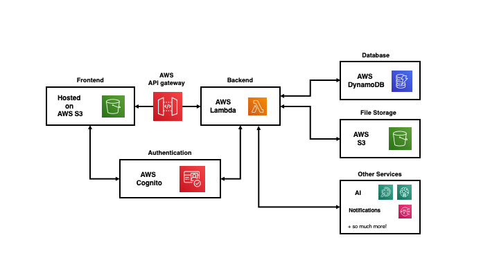

# Build a Fullstack + Serverless Web App using AWS Amplify 

Welcome! This is a beginner workshop targetted at University students (studying IT / Computer Science) who are new to Amazon Web Services. The main question we seek to answer by the end of this workshop is: 

`How can I use AWS to enhance my own personal projects?`

To answer this question, we will focus on using AWS to supercharge **web development**, specifically by:
1. Explaining the **benefits** of using AWS to build web applications.
2. Providing a high-level overview of key AWS services, including Lambda, S3, Cognito, API gateway, etc. 
3. Using AWS Amplify to seamlessly connect a range of AWS services to produce a fullstack, serverless web application. 

We hope that by the end of this workshop, you will not only be confident using AWS in your own projects, but you will realise the vast range of possibilities the AWS Cloud has to offer.

Table of Contents: 
* [Introduction to Workshop](#workshop-theory)
* [Setting up your Development Environment](#setting-up-your-development-environment)
* [Adding In-App Authentication]
* [Connecting to your Backend API]
* [Connecting to a Database]
* [Adding Machine Learning Features]

## Workshop Theory
As a University student, you may have had some experience creating small, mini applications as part of your assessments - for example, random websites, algorithmic chunks of code, or just random python scripts. But you may be wondering, how are industrial, fully-fledged applications, such as Facebook, Google or even Github, actually built? 

### What is the architecture of a traditional application? 


As seen in the diagram above, the architecture of fully-fledged web applications is fairly complicated, and consist of so many different components responsible for different tasks. 

1. **Frontend**: The user interface of the website. 
2. **Backend**: A server that holds the main code logic of the website, and interacts with the database, file storage systems, and other services. 
3. **Authentication**: A service that authenticates the username and password of the user, allowing the logged-in user to interact with the backend.
4. **Database**: Stores application data.
5. **File Storage**: Stores files and attachments. 
6. **Other Services**: Could include notification services, AI services, and other 3rd party services your web app may be interacting with. 

A few challenges / issues associated with this:
1. With so many different components, it's tedious and time-consuming to manually provision ALL components, configure them, before connecting them all together to build a single application. 
2. Each component needs to run on a server (a computer) - this could be expensive to run over long periods of time AND to maintain. 

The solution: **Amazon Web Services**! 

### How do you build applications in the cloud? 



Building cloud-native fullstack web applications have several benefits:

1. **Services**: As seen in the diagram above, the different components of an application correspond to different AWS services. Rather than building your own components from scratch, AWS provides a range of services to supercharge your web applications. 

   1. **AWS S3**: A file storage service - can be used for hosting your frontend website, as well as other files / attachments. 
   2. **AWS Cognito**: An authentication service - handles user registration, authentication, stores data about all your users + more. 
   3. **AWS API Gateway**: Acts as the 'front door' for websites to access data, business logic, and other functionality from your backend. 
   4. **AWS Lambda**: Lets you run code (in the backend) without provisoning or mangaging servers. 
   5. **AWS DynamoDB**: A database solution that lets you store data without provisoning or mangaging servers. 

2. **Serverless**: All of the services in the above diagram are 'serverless'. This does not mean that they do not run on servers (everything has to be run on a computer), but it means that: 
   1. You don't have to manage or maintain these servers - Amazon takes care of everything. 
   2. You only pay for what you use - it's a LOT cheaper. 

3. **Using AWS Amplify**: While AWS provides all these services to build a web application, a developer must still manually configure and connect all these services together. However, **AWS Amplify** is a framework that allows you to automatically provision and connect ALL these services in literally minutes. Each service is treated like a plug-and-play module, rapidly speeding up the process of web application development. 

We will be using AWS Amplify to build our fullstack, cloud-native web application today!

## Setting up your Development Environment

### Provisioning a Cloud 9

1. Goto your AWS console via this link: https://aws.amazon.com/

2. Search up and click Cloud 9 in the 'Services' section.

3. Click 'Get Started'

4. Choose a name (e.g. amplify-workshop). Click 'Next'. Under 'Instance Type' select 'Other instance type', and search for 't3.medium' in the dropdown search.

5. Leave everything else as default, and click 'Create Environment'.

### Setting up your Amplify + React application

1. Clone the current repository to your Cloud9 IDE. 
   
   ```bash
   git clone
   ```
   
2. Move into the cloned directory, and install all required packages. 

   ```bash
   cd amplify-workshop
   npm install
   ```
   
3. Install the Amplify CLI and initialise the project (as an Amplify app)
   ```bash
   npm install -g @aws-amplify/cli
   amplify init
   ```
   
4. Run the React application
   ```bash
   npm start
   ```
   
5. After the app has compiled successfully, click 'Tools' in the toolbar up top, click 'Preview' and finally click 'Preview Running Application'. Open the preview in another tab by clicking the arrow / box button on the right of the search bar. 

You should see a basic React web application running in your browser! 


## Adding In-App Authentication
AWS Amplify uses AWS Cognito as its authentication service. AWS Cognito is a robust user directory service that handles user registration, authentication, account recovery & other operations. 

In this section, we will add a log-in and sign-up page, as well as a sign-out button. 

1. To add authentication to your Amplify project, run the following command, and follow the guided instructions. 

    ```bash
    amplify auth add
    
    Do you want to use the default authentication and security configuration? Default configuration
    How do you want users to be able to sign in? Username
    Do you want to configure advanced settings?  No, I am done.
    ```    
    
2. To push it to the Cloud, run the following command: 

   ```bash
   amplify push
   ```

## Connecting to your Backend API

1. Run the following command: 

    ```bash
    amplify api add
    ```

## Connecting to a Database

1. Run the following command: 

    ```bash
    amplify storage add
    ```
    
2. Run the following command: 

    ```bash
    amplify function add
    ```

3. Run the following command: 

    ```bash
    amplify api update
    ```

## Adding Machine Learning Features

1. Run the following command: 

    ```bash
    amplify predictions add
    ```

